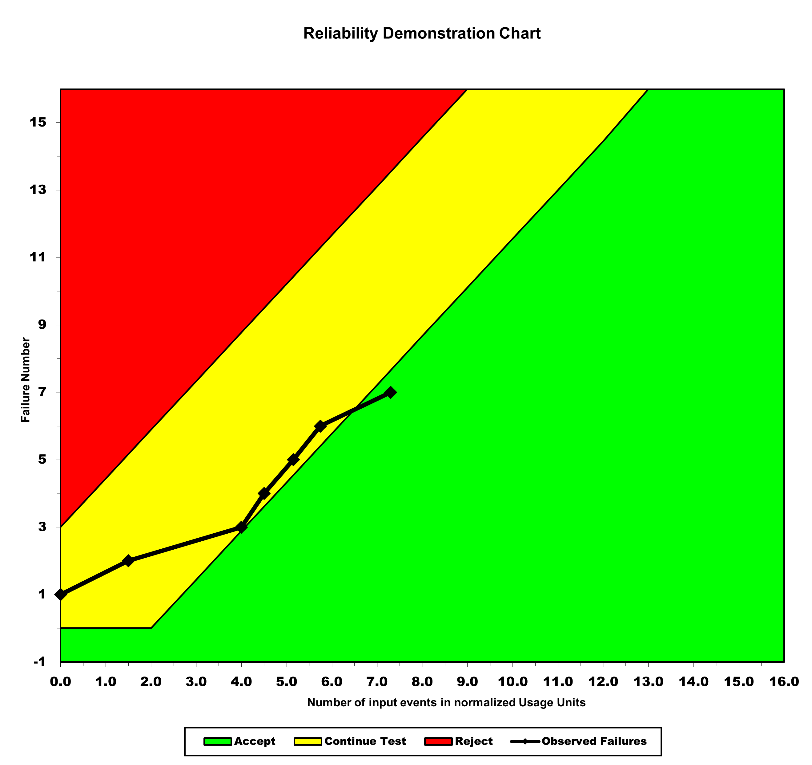
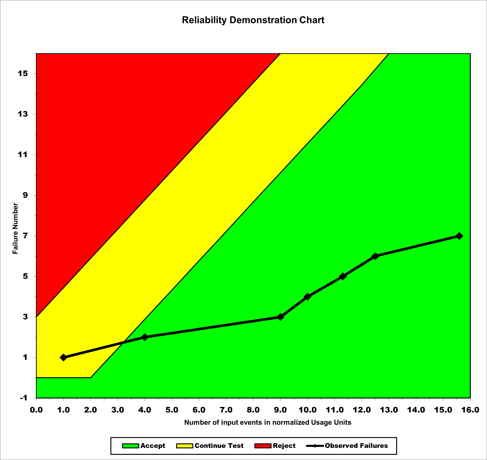

**SENG 438- Software Testing, Reliability, and Quality**

**Lab. Report \#5 – Software Reliability Assessment**

| Group \#:       |   |
|-----------------|---|
| Student Names:  |   |
|      Oliver Molina           |   |
|      Quentin Jennings           |   |
|      Nour Jaffan           |   |
|      Danny Picazo           |   |

# Introduction
In the previous assignments, we have learned how to properly test a system through exploratory, white-box, and black-box testing as well as how to test a web system's GUI. Our previous assignments mostly concerned automated unit testing but with this assignment our focus is shifted into reliability acceptance testing as we determine the quality of a system. Our group has been tasked with assessing a software's quality using both Reliability Growth Testing and a Reliability Demonstration Chart in order to analyse the system's Mean Time To Failure (MTTF) and reliability through failure counts.

In order to perform these tasks we used C-SFRAT, and SRTAT, tools that can analyse and present input data in forms more readable to us and. Using the [[INSERT DATA SET]] dataset and after formatting it so it is readable by and [[INSERT DATA PARAMETERS]] parameters, we can create a reliability model and make predictions for the future. Reliability Growth Testing is used to analyse trends in changing failure rates whereas the Reliability Demonstration Chart is used to efficiently check if a target failure rate is met or not. λ represents the real failure rate while λF represents the target failure rate.

Following will be an analysis of both reliability analysis tools and a discussion and comparison between the results. 
# 

# Assessment Using Reliability Growth Testing 

# Assessment Using Reliability Demonstration Chart 
## RDC MTTF min

## RDC MTTF half min

## RDC MTTF double min

# 

# Comparison of Results
Using reliability growth testing, the models with the smalles log likelihood are the most accurate thus the S model and DW3 models would be the best to use.

From our Laplace Test statistic on dataset3 we found that the best range of testable data is wihin the values of 3 - 15.

Next we ran the RDC tests on Dataset3 and setting the MTTF to its minimum for crossing into the acceptability range. When setting the MTTF to half that value it remained in the continue tests range indicating we would need to run more tests and have a larger dataset to have clear and decisive results. Finally setting the MTTF to half its minimum value we see that it very quickly passes into the range of acceptability.
# Discussion on Similarity and Differences of the Two Techniques
Similarities:

* RDC and RGT aim to improve the quality of the software product.
* Both techniques require the use of a test plan to guide the testing process.
* Both techniques involve the selection of test cases based on certain criteria.

Differences:

* RDC is a statistical technique that compares the results of a control group and an experimental group, while RGT is a testing approach that prioritizes test cases based on the potential risk of failure.
* RDC is typically used to evaluate the effectiveness of a particular software testing approach or tool, while RGT is used to identify high-risk areas of the software product that require more testing effort.
* RDC requires a larger sample size to ensure statistical significance, while RGT can be applied with a smaller set of test cases as long as they are prioritized based on risk.
# How the team work/effort was divided and managed
Since no unit test development or programming was required for this, we didn't really need any methodological approach to dividing team work so we simply held regular meetings in both analysis and report writing. All members contributed to the assignment and work was divided equally between members.
# 

# Difficulties encountered, challenges overcome, and lessons learned
We encountered quite a bit of difficulty with using SRTAT and C-SFRAT. The first of which is that we had to decide on a data set as we had a folder with multiple options and we had to format it in a way readable to the program. (eg converting .txt to an excel spreadsheet) Even with proper data we could not get some features to work for SRTAT and we determined the program is built around a much older version of Windows or Java and certain exceptions are thrown even if we do things correctly, making the process of actually getting the data quite difficult. While this made the lab take much longer to perform we were able to overcome it and we learned how to use the program on our own and how to do the tasks independent of guidance, a valuable skill in software engineering.

# Comments/feedback on the lab itself
Unlike the previous assignments which while time-consuming were relatively straight forward, this one kind of left our group in the dark on what we were actually supposed to do. The assignment description was lot more vague and didn't really tell us how we were supposed to use the program and seemed to be outdated for a different version of windows or the program. More descriptive instructions on properly using the programs and a single data set given in the required format would have helped immensely.
